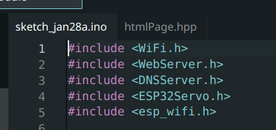
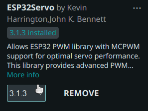
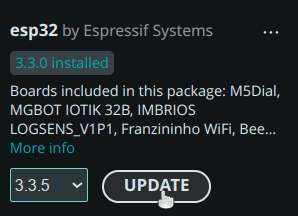
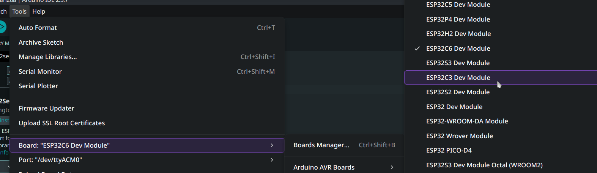

# Demo-Firmware für Servocontroller Lötkurs 2026

## Installieren mit PlatformIO

`platformio run -t upload`

## Installieren mit Arduino-IDE

main.cpp in neuen Sketch kopieren, htmlPage.hpp in neue Datei im Sketch-Ordner (ganz rechts neben den tabs, die drei Punkte, neue Datei), sollte so aussehen:

Library installieren: 

Board installieren: 

Auf dem Board: Sicherstellen, das der Power-Schalter auf "on" steht

Reset + Download-Knopf gedrückt halten, Reset loslassen, dann Download loslassen

Board im Dropdown auswählen

Dann auswählen:

Dann kompilieren und herunterladen

Dann Reset drücken, wenn fertig